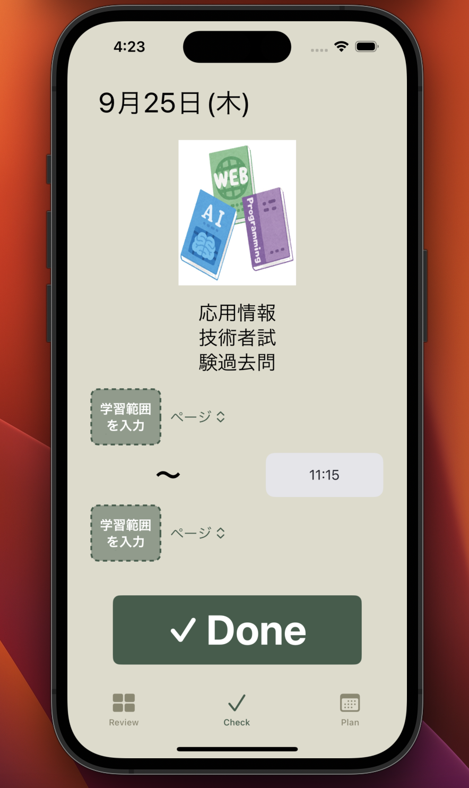
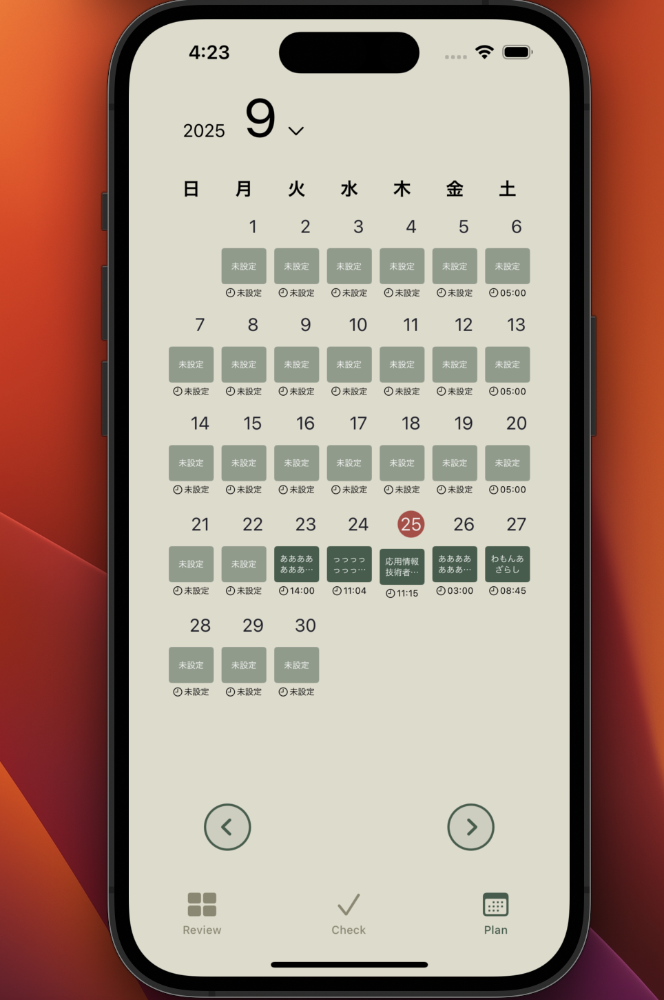
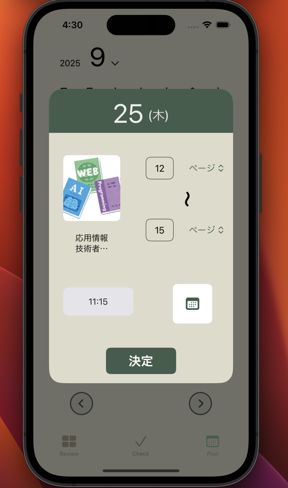
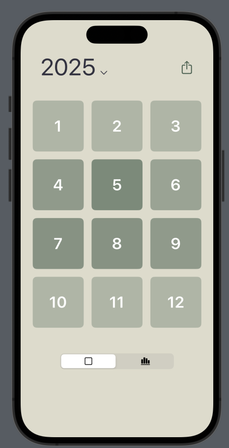
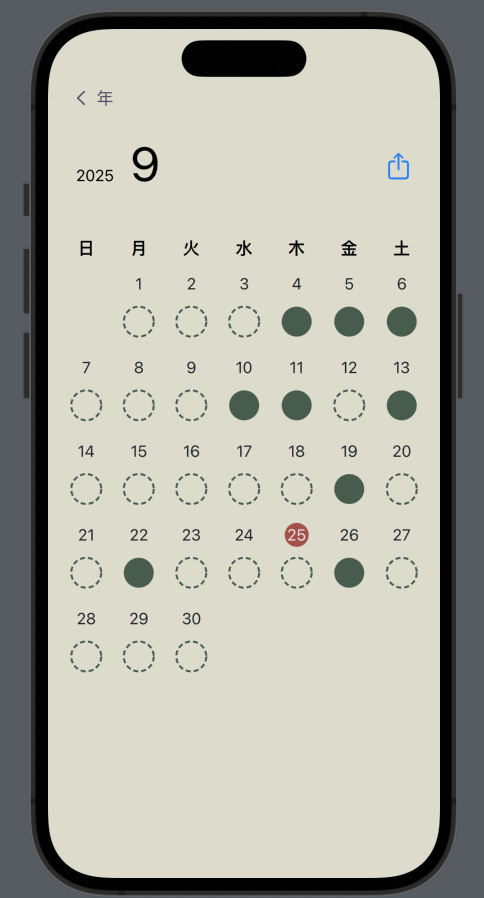
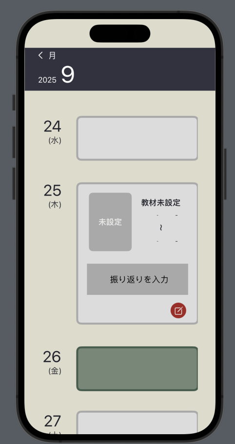

# StudyRecord


時間のない人のための学習記録アプリ

## 概要
StudyRecordは日ごとの学習内容を記録・振り返りできる iOS アプリです． 
シンプルな操作で「今日やったこと」を登録し，学習の予定を立て，日／月／年単位で学習の積み上げを確認する事ができます．

## ユースケース
- 毎日の学習記録を可視化してモチベーション維持したい人
- 時間の無い中で資格取得や読書を継続したい社会人

## 特徴
- Check画面では１つのボタンを押すだけで手軽にその日の学習を記録することができます．
- Plan画面では学習に使う教材，学習範囲，学習開始時刻を入力し学習予定を立てることができます．
- Review画面では年別，月別，日別の学習記録の振り返り，スクリーンショットをSNS共有することができます．

## スクリーンショット 

### Check画面
<p align="center">

</p>
<p>毎日の学習記録をワンタップで入力</p>

### Plan画面
<p align="center">
  
  
</p>
<p>左：カレンダーで予定を一覧表示　右：予定入力画面</p>

### Review画面
<p align="center">
  
  
  
</p>
<p>左：年間の学習量（GitHub風）　中：月ごとの学習日　右：1日ごとの振り返り</p>

## デモ


素早く学習を記録，明日の予定立てをすることができます．


iPhoneに標準搭載されているカレンダーアプリと連携しています．カレンダーアプリの繰り返し機能にも対応しています．

## 技術スタック
- **開発言語**: Swift 5.9
- **UIフレームワーク**: SwiftUI
- **設計パターン**: MVVM（表示・処理・データを整理して保守しやすくする仕組み）
- **データ保存**: Core Data（iPhone内に学習記録を保存）
- **非同期処理**: async/await
- **テスト**: Unit Test, UI Test
- **CI/CD**: GitHub Actions（自動ビルド・自動テスト）
- **開発環境**: Xcode 15 / iOS 16 以上対応（iOS 17で検証済み）
  
## こだわり
- スクリーンショットをSNS共有した時，一目でどのくらい学習したか視覚的にわかりやすいようにReview画面のUIを作りました
- Appleのデフォルトのカレンダーアプリと連携することで，スケジュールの隙間時間を見つけて学習予定を立てれるようにしました．

## 使い方
1. このリポジトリをクローン  
   ```bash
   git clone https://github.com/plm1000Leaf/StudyRecord.git

2. StudyRecord.xcodeproj を Xcode で開く

 3.　実機またはシミュレータを選択してビルド（⌘R）

## 今後
- 学習の振り返りを送信したら，AIを使った応援メッセージが返信される機能．
- 教材ごとに学習状況を振り返る機能.
- Check画面(チェック後)のアニメーション追加．
- データ移行しやすいユーザー登録機能．
- 学習記録を競うフレンド機能．
- ウィジェットで学習継続記録を表示．

## アプリの要件定義(Notionリンク)
https://www.notion.so/1774306e95c58069b7f8d7647448f31d

## ライセンス
このソフトウェアは MIT ライセンスのもとで公開しています。  
詳細は [LICENSE](LICENSE) ファイルをご覧ください。
